# 数据链路层

## 数据链路层的基本概念

结点：主机，路由器  

链路：网络中两个结点之间的物理通道，链路的传输介质主要有双绞线、光纤和微波。分为有线链路、无线链路。  

数据链路：网络中两个结点之间的逻辑通道，把实现控制数据传输协议的硬件和软件加到链路上就构成数据链路。  

帧：链路层的协议数据单元，封装网络层数据报。  

数据链路层负责通过一条链路从一个结点向另一个物理链路直接相连的相邻结点传送数据报。  

## 数据链路层功能

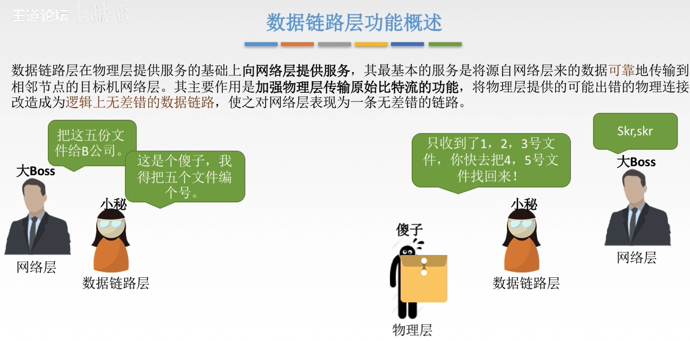  

功能一：为网络层提供服务。无确认无连接服务，有确认无连接服务，有确认面向连接服务**有连接一定有确认**  

功能二：链路管理，即连接的建立、维持、释放（用于面向连接的服务）  

功能三：组帧  

功能四：流量控制  (限制发送方)  

功能五：差错控制(帧错与位错)  

### 封装成帧

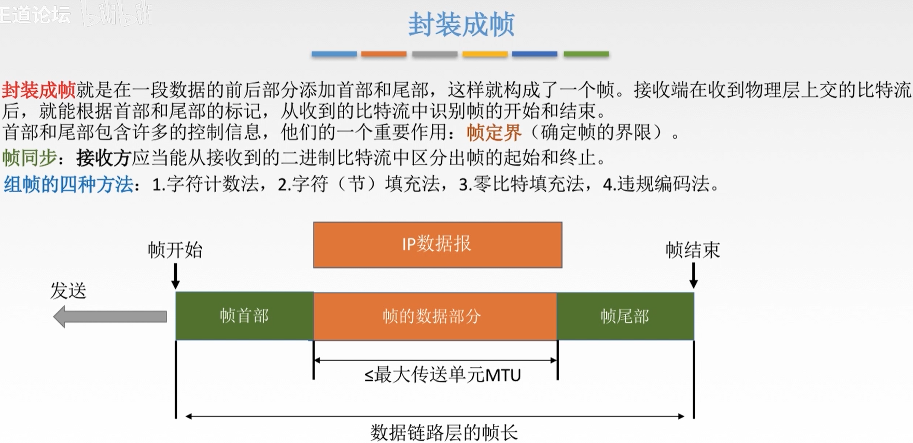  

### 透明传输

透明传输是指不管所传数据是什么样的比特组合，都应当能够在链路上传送。因此，链路层就“看不见”有什么妨碍数据传输的东西。  

当所传数据中的比特组合恰巧与某个控制信息完全一样时，就必须采取适当的措施，使接收方不会将这样的数据误认为时某种控制信息。这样才能保证数据链路层的传输是透明的。

#### 字符计数法

帧首部使用一个计数字段(第一个字节，8位)来标明帧内字符数。  

  

痛点：如果第一个字节发生了错误，则后面全部都错误了。  

#### 字符填充法

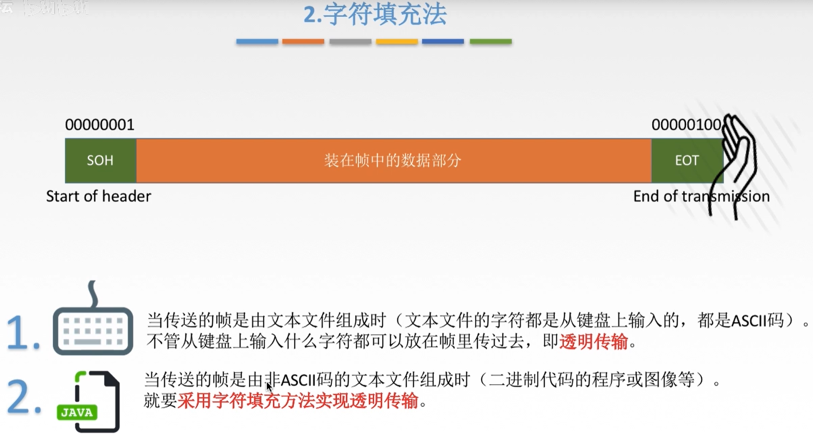  

  

#### 零比特填充法

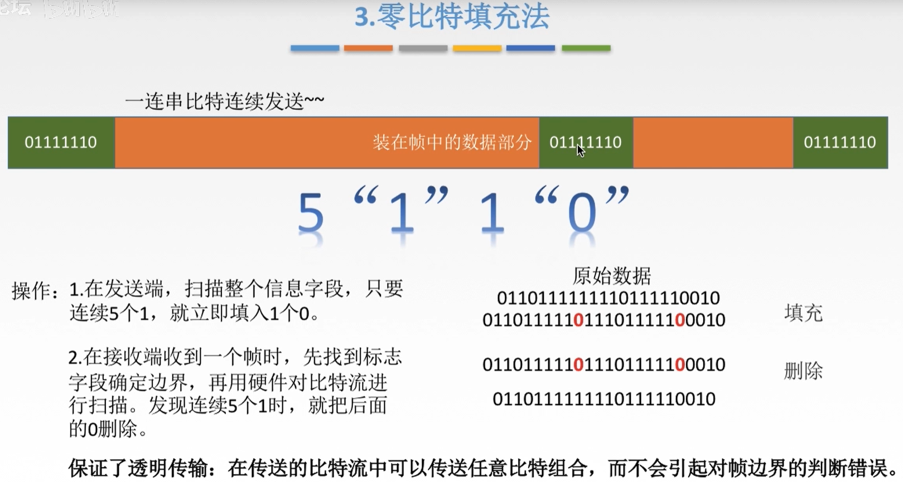  

#### 违规编码法

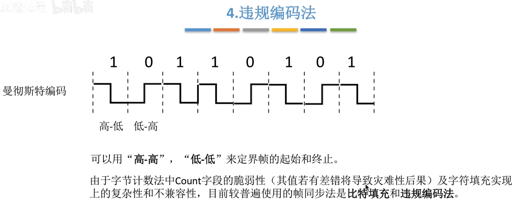  

### 差错控制

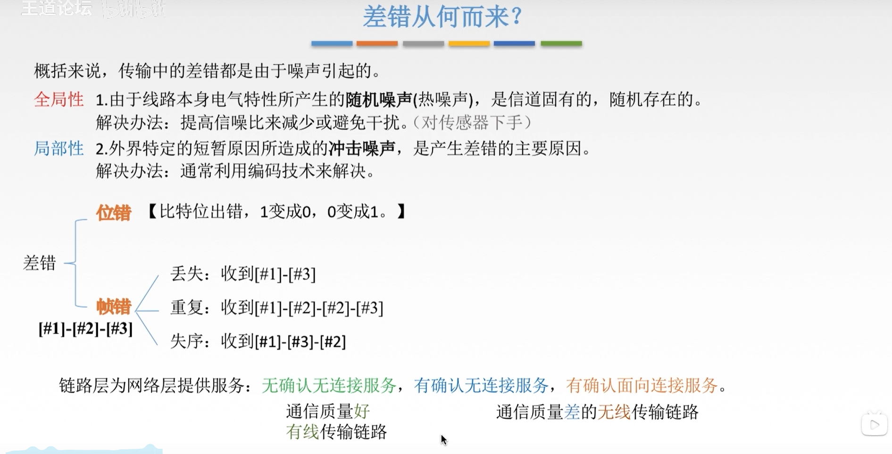  

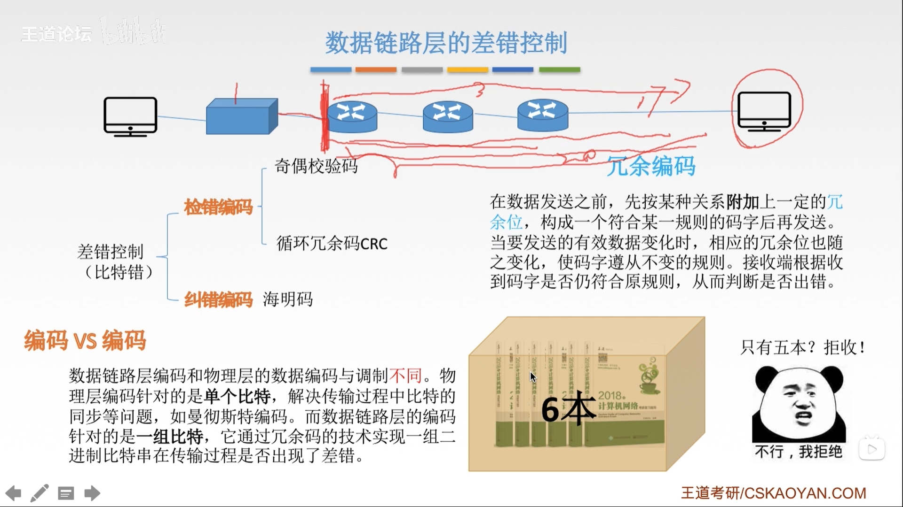  

### 检错编码

#### 奇偶校验码

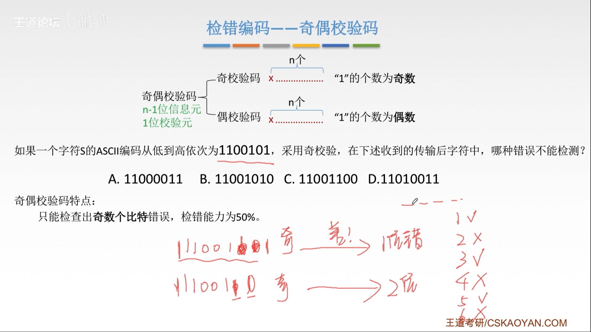  

#### CRC循环冗余码 

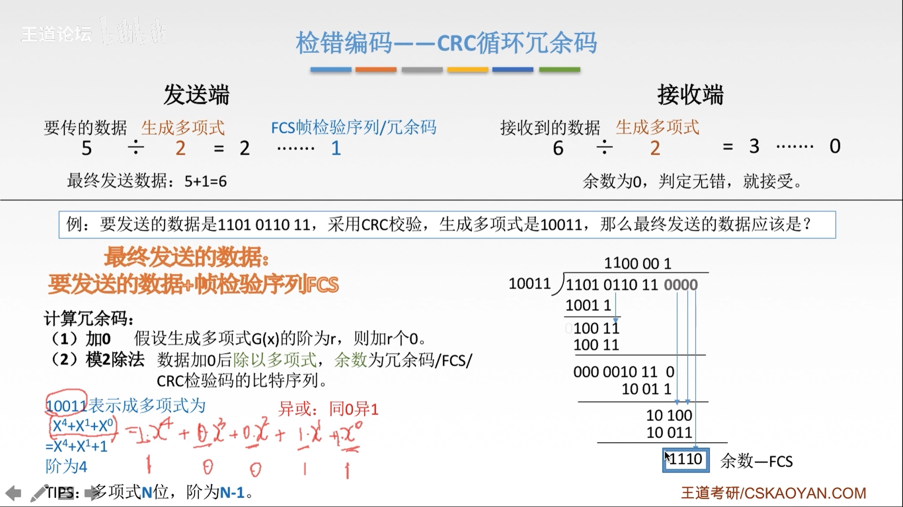  

  

  

### 纠错编码

#### 海明码

> 能发现双比特错，只能纠正单比特错

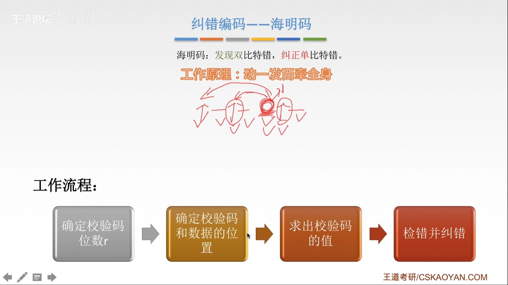  

**1、确定校验码位数r**  

  

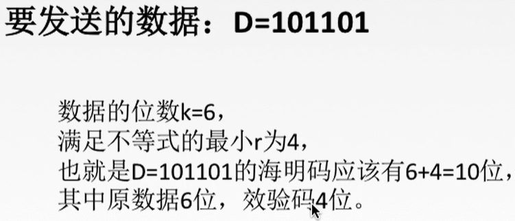  

**2、确定校验码和数据的位置**  

**校验码只能放入2的次方位置**

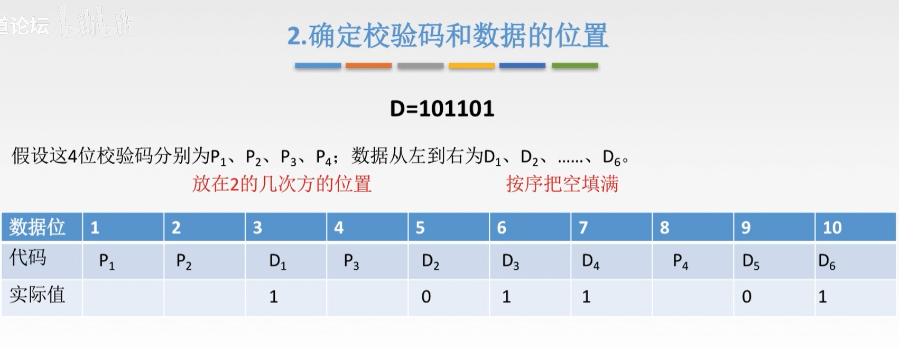 

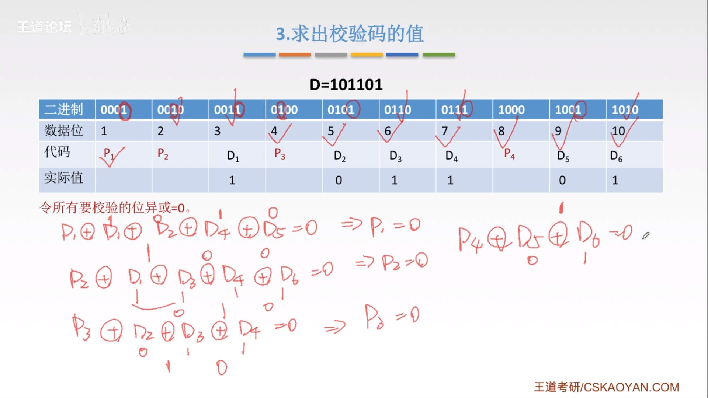  

## 可靠传输以及流量控制

**数据链路层的流量控制**

**较高的发送速度**和**较低的接收能力**的不匹配，会造成传输出错，因此流量控制也是数据链路层的一项重要工作。  

数据链路层的流量控制是点对点(每两个相邻节点之间)的，而传输层的流量控制是端到端(两个主机之间)的。  

  

数据链路层流量控制手段： 接收方收不下就不回复确认。  

传输层流量控制手段： 接收端给发送端一个窗口公告。  

### 流量控制的方法

#### 停止-等待协议

每发送完一个帧就停止发送，等待对方的确认，在收到确认后再发送下一个帧  

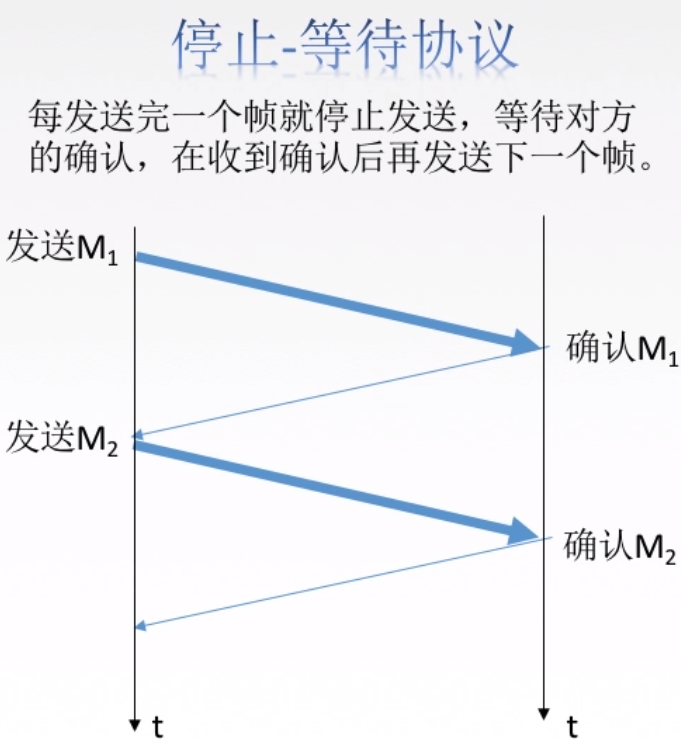    

停止等待协议性能较低，信道利用率太低  

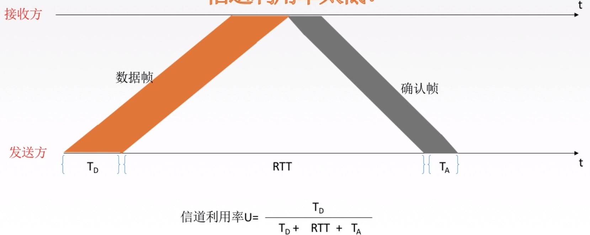  

信道利用率： 发送方在一个发送周期内，有效地发送数据所需要的时间占整个发送周期的比率  

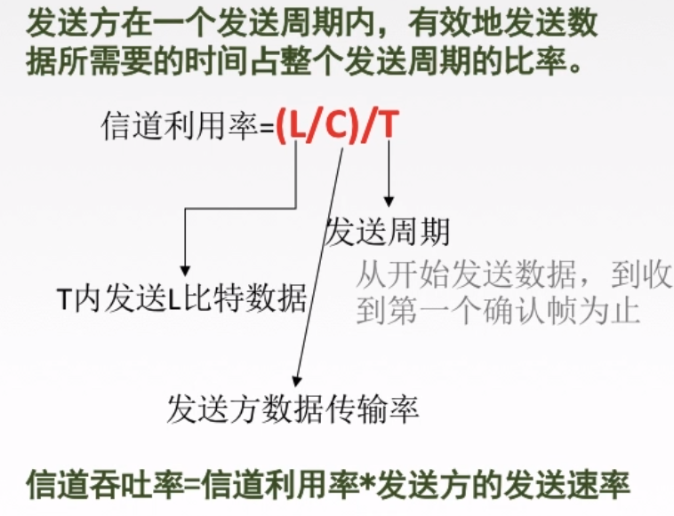  

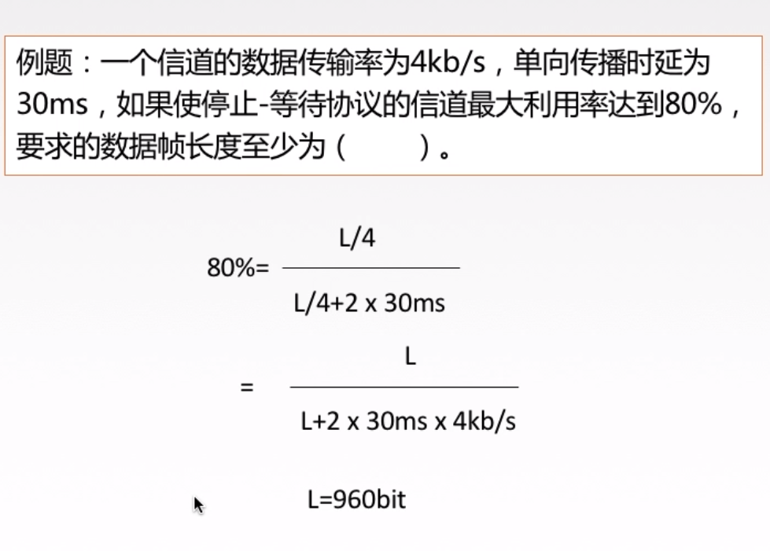  

>  计算方法：信道利用率 = (数据发送时延) / T(传播时延 + 数据发送时延)
>
> 数据发送时延 = L(数据帧长) / C(数据发送速率)
>
> 发送周期 = 数据发送时延 + 传播时延 + 确认帧发送时延(**注**：这个时延由于题目中没给出确认帧长度，所以忽略)
>
> 传播时延 = 2 * 单向传播时延
>
> (L / 4000) / (2 * 0.03 + L / 4000) = 0.8
>
> 则L = 960bit

#### 滑动窗口协议

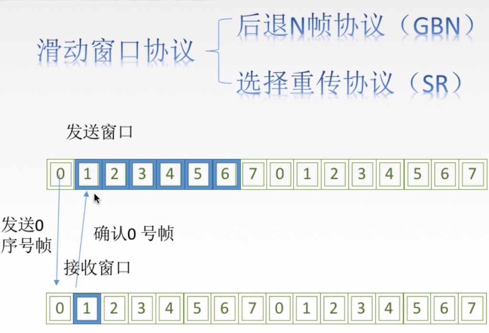

##### 后退N帧协议(GBN)

发送窗口：发送方维持一组连续的允许发送的帧的序号。  

接收窗口：接收方维持一组连续的允许接收帧的序号。  

  

 

##### 选择重传协议(SR)

#### 总结

停止等待协议：  发送窗口大小=1，接收窗口大小=1  

后退N帧协议(GBN)：发送窗口大小>1，接收窗口大小=1  

选择重传协议(SR)：发送窗口大小>1，接收窗口大小>1  

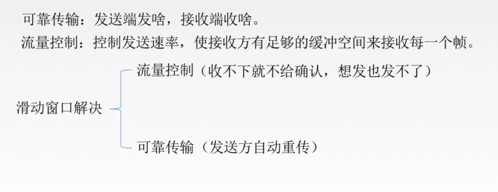  

 