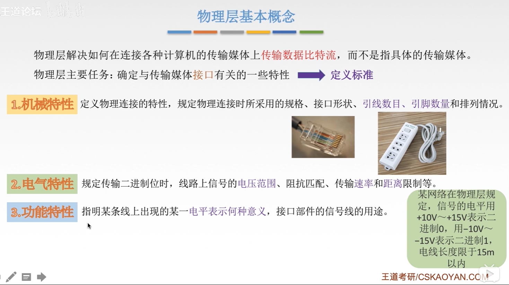
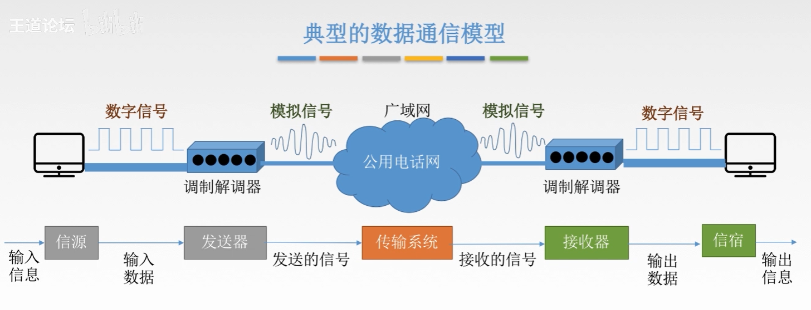
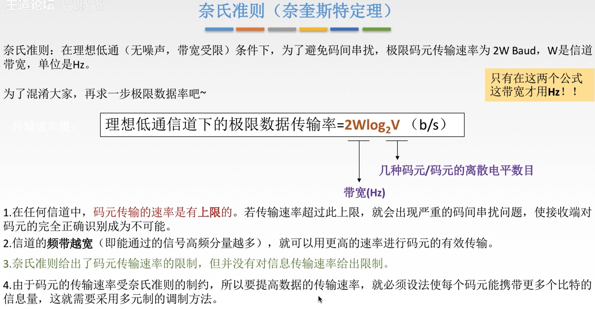
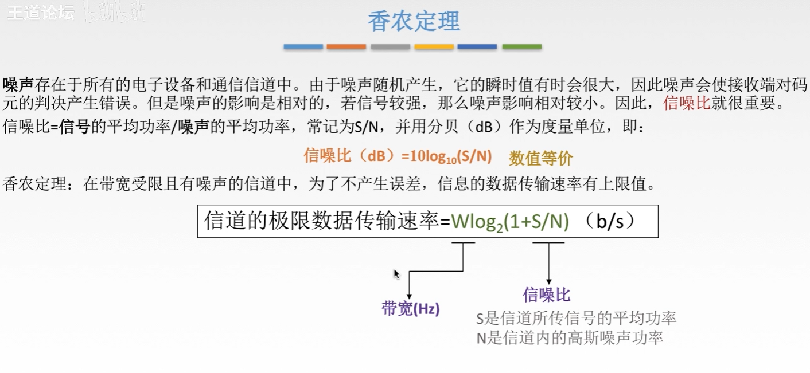
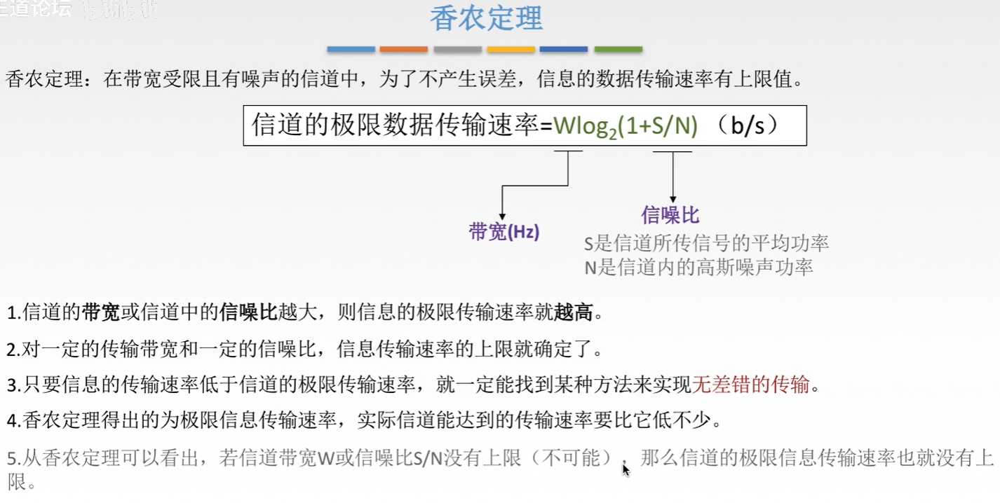
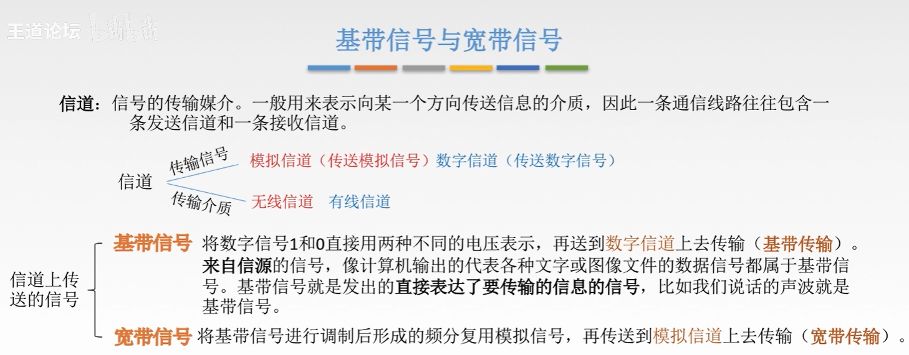
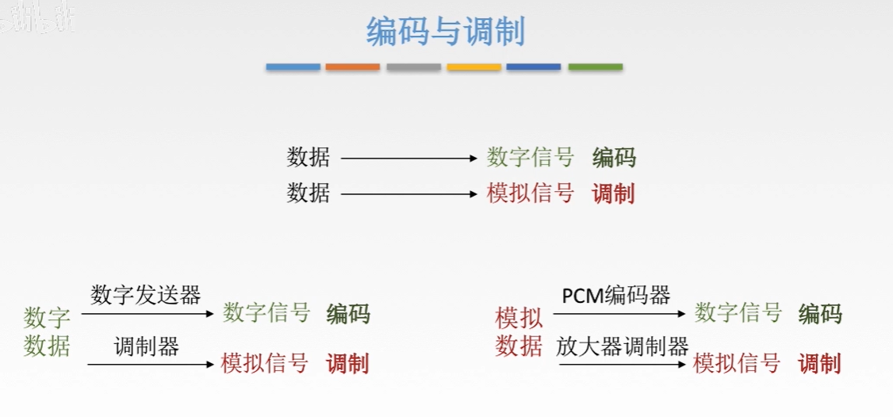
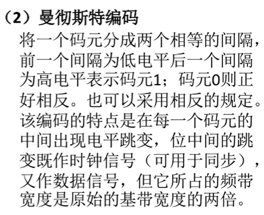
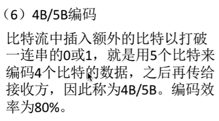
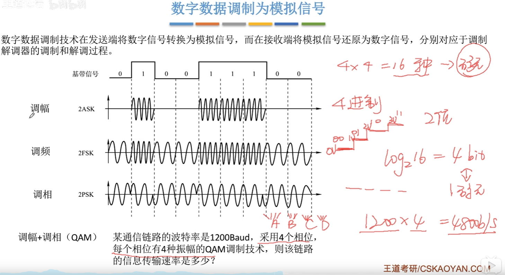

# 第一章

物理层解决如何在连接各种计算机的传输媒体上传输数据比特流，而不是指具体的传输媒体。  

物理层主要任务： 确定与传输媒体接口有关的一些特性(定义标准)  

## 数据通信模型

  

## 三种通信方式

  

## 两种数据传输方式

  

## 码元

码元是指用一个**固定时长**的**信号波形**(数字脉冲)，代表不同离散数值的基本波形，是数字通信中数字信号的计量单位，这个时长内的信号称为k进制码元，而该时长称为码元宽度。当码元的离散状态有M个时(M大于2)，此时码元为M进制码元。  

1码元可以携带多个比特的信息量。例如，在使用二进制编码时，只有两种不同的码元，一种代表0状态，一种代表1状态。  

##  速率、波特、带宽

  

##  失真

  

**码间串扰**  

  

接收端收到的信号波形失去了码元之间清晰界限的现象就是码间串扰。  

### 奈氏准则(限制的是码元传输速率)

在理想低通(低于最高频率)(无噪声，带宽受限)条件下，为了避免码间串扰，极限码元传输速率为2W Baud，W是信道带宽，**单位是Hz**  

  

### 香农定理

  

**推论**  

  

 

  

## 基带信号与宽带信号

  

在传输距离较近时，计算机网络采用基带传输方式(近距离衰减小，从而信号内容不易发生变化)  

在传输距离较远时，计算机网络采用宽带传输方式(远距离衰减大，即使信号变化大也能最后过滤出来基带信号)  

  

## 编码与调制

### 数字数据编码为数字信号

  

#### 非归零编码

  

#### 曼彻斯特编码

  

#### 差分曼彻斯特编码

#### 归零编码

    

#### 反向不归零编码

  

#### 4B/5B编码

  

### 数字数据调制为模拟信号

数字数据调制技术在发送端将数字信号转换为模拟信号，而在接收端将模拟信号还原为数字信号，分别对应于调制解调器的调制和解调过程  

  

### 模拟数据编码为数字信号

