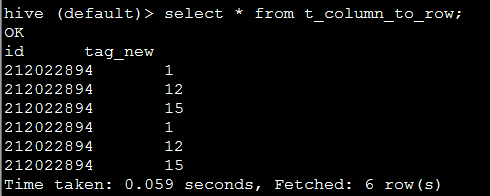
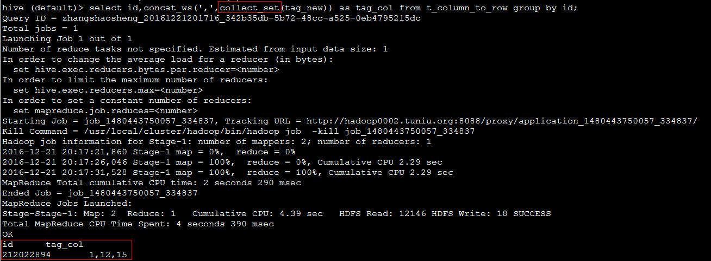
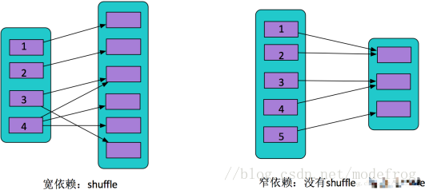

# 数仓

## 数仓分层每一层分别的职能是干什么的

**ODS**: 存放原始数据  

**DWD**: 结构和粒度与ods层保持一致，对ods层数据进行清洗(去除空值，脏数据，超过极限范围的数据)，也有公司叫dwi。去除空值，脏数据，超过极限范围的  

**DWS**: 以dwd为基础，进行轻度汇总。一般聚集到以用户当日，设备当日，商家当日，商品当日等等的粒度。在这层通常会有以某一个维度为线索，组成跨主题的宽表，比如 一个用户的当日的签到数、收藏数、评论数、抽奖数、订阅数、点赞数、浏览商品数、添加购物车数、下单数、支付数、退款数、点击广告数组成的多列表。  

**ADS**: 面向实际的数据需求，以DWD或者DWS层的数据为基础，组成的各种统计报表。
统计结果最终同步到RDS以供BI或应用系统查询使用

## 数仓建模了解么，说一下kimball建模

https://www.jianshu.com/p/78ba03bcc01e

## 说一下雪花模型与星型模型

雪花模型是当有一个或多个维表没有直接连接到事实表上，而是通过其他维表连接到事实表上时，其图解就像多个雪花连接在一起，故称雪花模型

> 在多维分析的商业智能解决方案中，根据事实表和维度表的关系，又可将常见的模型分为星型模型和雪花型模型。在设计逻辑型数据的模型的时候，就应考虑数据是按照星型模型还是雪花型模型进行组织。
>
> 当所有维表都直接连接到“ 事实表”上时，整个图解就像星星一样，故称为星型模型。星型架构是一种非正规化的结构，多维数据集的每一个维度都直接与事实表相连接，不存在渐变维度，所以数据有一定的冗余。
>
> 雪花模型是对星型模型的维表进一步层次化，原有的各维表可能被扩展为小的事实表，形成一些局部的 "层次 " 区域，这些被分解的表都连接到主维度表而不是事实表。
>
> 相比星型模型，雪花模型的特点是贴近业务，数据冗余较少，但由于表连接的增加，导致了效率相对星型模型来的要低一些。星型模型和雪花模型的区别在于：维度表是直接连接到事实表还是其他维度表

星型模式是多维的数据关系，它由事实表（Fact Table）和维表（Dimension Table）组成。每个维表中都会有一个维作为主键，所有这些维的主键结合成事实表的主键。事实表的非主键属性称为事实，它们一般都是数值或其他可以进行计算的数据。  

当所有维表都直接连接到“ 事实表”上时，整个图解就像星星一样，故将该模型称为星型模型。

## 数仓里的缓慢变化维

https://www.cnblogs.com/xqzt/p/4472005.html

## 说一下什么是拉链表，拉链表是为了解决什么问题

拉链表，记录每条信息的生命周期，一旦一条记录的生命周期结束，就重新开始一条新的记录，并把当前日期放入生效开始日期。  

拉链表适用于行中只有少部分发生变化，但是大部分是不变的。  

缺点：补数极其不友好，你必须从拉链里面把某一天的快照算出来

## hive里面行转列，列转行怎么实现

  

```sql
-- 行转列
select id,tag,tag_new from t_row_to_column_tmp lateral view explode(split(tag, ',')) num as tag_new where id=212022894;
```

  

  

 ```sql
--列转行
select id,concat_ws(',',collect_set(tag_new)) as tag_col from t_column_to_row group by id;
 ```

    

## spark宽窄依赖说一下

  

宽依赖是一个partition对应了下游多个partition。窄依赖是一个partition对应了下游一个partition。  

## spark有哪些算子是宽依赖(换个问法，shuffle算子)

**去重**    

```scala
def distinct()
def distinct(numPartitions: Int)
```

**聚合**  

```scala
def reduceByKey(func: (V, V) => V, numPartitions: Int): RDD[(K, V)]
def reduceByKey(partitioner: Partitioner, func: (V, V) => V): RDD[(K, V)]
def groupBy[K](f: T => K, p: Partitioner):RDD[(K, Iterable[V])]
def groupByKey(partitioner: Partitioner):RDD[(K, Iterable[V])]
def aggregateByKey[U: ClassTag](zeroValue: U, partitioner: Partitioner): RDD[(K, U)]
def aggregateByKey[U: ClassTag](zeroValue: U, numPartitions: Int): RDD[(K, U)]
def combineByKey[C](createCombiner: V => C, mergeValue: (C, V) => C, mergeCombiners: (C, C) => C): RDD[(K, C)]
def combineByKey[C](createCombiner: V => C, mergeValue: (C, V) => C, mergeCombiners: (C, C) => C, numPartitions: Int): RDD[(K, C)]
def combineByKey[C](createCombiner: V => C, mergeValue: (C, V) => C, mergeCombiners: (C, C) =>...
```

**排序**  

```scala
def sortByKey(ascending: Boolean = true, numPartitions: Int = self.partitions.length): RDD[(K, V)]
def sortBy[K](f: (T) => K, ascending: Boolean = true, numPartitions: Int = this.partitions.length
```

**重分区**  

```scala
def coalesce(numPartitions: Int, shuffle: Boolean = false, partitionCoalescer: Option[PartitionCoalescer] = Option.empty)
def repartition(numPartitions: Int)(implicit ord: Ordering[T] = null)
```


## groupByKey和reduceByKey这两个算子的区别

1、首先他们都是要经过shuffle的，groupByKey在方法shuffle之间不会合并原样进行shuffle，。reduceByKey进行shuffle之前会先做**合并**,这样就**减少了shuffle的io传送**，所以**效率高一点**。

2、  

```scala
combineByKeyWithClassTag[CompactBuffer[V]](createCombiner, mergeValue, mergeCombiners, partitioner, mapSideCombine = false)
```

 reduceByKey是这样实现的

`combineByKeyWithClassTag[V]((v: V) => v, func, func, partitioner)`

```scala
def combineByKeyWithClassTag[C](  
      createCombiner: V => C,  
      mergeValue: (C, V) => C,  
      mergeCombiners: (C, C) => C,  
      partitioner: Partitioner,  
      mapSideCombine: Boolean = true,  
      serializer: Serializer = null)(implicit ct: ClassTag[C]): RDD[(K, C)] = self.withScope {  
```

mapSideCombine默认为true，也就是说reduceByKey会在map段进行合并，**这也是下面bypass机制中的一个条件**

https://blog.csdn.net/weixin_41804049/article/details/80373741

## RDD、DataFrame、DataSet的区别是什么

**RDD**

- RDD是一个懒执行的不可变的可以支持Lambda表达式的并行数据集合。  
- RDD的最大好处就是简单，API的人性化程度很高。  
- RDD的劣势是性能限制，它是一个JVM驻内存对象，这也就决定了存在GC的限制和数据增加时Java序列化成本的升高。  

**Dataset**

1、是Dataframe API的一个扩展，是Spark最新的数据抽象  
2、用户友好的API风格，既具有类型安全检查也具有Dataframe的查询优化特性。  
3、Dataset支持编解码器，当需要访问非堆上的数据时可以避免反序列化整个对象，提高了效率。  
4、样例类被用来在Dataset中定义数据的结构信息，样例类中每个属性的名称直接映射到DataSet中的字段名称。  
5、**Dataframe是Dataset的特例**，DataFrame=Dataset[Row] ，所以可以通过as方法将Dataframe转换为Dataset。Row是一个类型，跟Car、Person这些的类型一样，所有的表结构信息我都用Row来表示。  
6、DataSet是强类型的。比如可以有Dataset[Car]，Dataset[Person].  

https://blog.csdn.net/weixin_43087634/article/details/84398036

## 说一下Spark的shuffle

## 讲一下bypass机制

https://www.cnblogs.com/itboys/p/9226479.html

## 讲一下Spark统一内存管理

https://blog.csdn.net/zyzzxycj/article/details/82740733

## 说一下Flink的背压

https://blog.csdn.net/u011750989/article/details/82191298

## checkpoint与savepoint的区别

1、checkpoint的侧重点是“容错”，即Flink作业意外失败并重启之后，能够直接从早先打下的checkpoint恢复运行，且不影响作业逻辑的准确性。而savepoint的侧重点是“维护”，即Flink作业需要在人工干预下手动重启、升级、迁移或A/B测试时，先将状态整体写入可靠存储，维护完毕之后再从savepoint恢复现场。  

2、savepoint是“通过checkpoint机制”创建的，所以savepoint本质上是特殊的checkpoint。  

3、checkpoint面向Flink Runtime本身，由Flink的各个TaskManager定时触发快照并自动清理，一般不需要用户干预；savepoint面向用户，完全根据用户的需要触发与清理。  

3、checkpoint的频率往往比较高（因为需要尽可能保证作业恢复的准确度），所以checkpoint的存储格式非常轻量级，但作为trade-off牺牲了一切可移植（portable）的东西，比如不保证改变并行度和升级的兼容性。savepoint则以二进制形式存储所有状态数据和元数据，执行起来比较慢而且“贵”，但是能够保证portability，如并行度改变或代码升级之后，仍然能正常恢复。  

4、checkpoint是支持增量的（通过RocksDB），特别是对于超大状态的作业而言可以降低写入成本。savepoint并不会连续自动触发，所以savepoint没有必要支持增量。  

## JVM的内存模型

虚拟机栈(线程私有)：每个线程都会创建一个堆栈，对正在执行的方法进行入栈，执行完毕之后出栈。  

本地方法栈(线程私有)：当JVM在执行本地方法的时候，将会对方法进行入栈  

堆(线程共享)：JVM中内存最大的一块区域，存储着大量的对象，包括字符串常量池也存放于此  

PC计数器(线程私有)：记录着线程执行到了字节码的哪一行  

方法区(线程共享)：存放着class的元数据信息  

## 哪些变量在堆上分配，哪些变量在栈上分配

实例对象在堆中分配，这些对象通过new、newarray、anewarray和multianewarray等指令建立  

局部变量在栈上分配，栈中主要存放一些基本类型的变量（int, short, long, byte, float, double, boolean, char）和对象句柄

## 在方法内new了个基本类型array，这个array是在哪分配的

堆上分配，栈上存句柄

## 说一下java对象的生命周期

对象的整个生命周期大致可以分为7个阶段：创建阶段（Creation）、应用阶段（Using）、不可视阶段（Invisible）、不可到达阶段（Unreachable）、可收集阶段（Collected）、终结阶段（Finalized）与释放阶段（Free）。

https://blog.csdn.net/qq_25005909/article/details/78981512?fps=1&locationNum=2

## 讲一下不可视阶段

## CMS GC和G1 GC的区别是什么

## ArrayList和LinkedList的区别是什么

ArrayList底层是数组，LinkedList底层是链表结构。LinkedList由于在类中保存指针信息，所以内存消耗比ArrayList大

## HashMap底层数据结构说一下

数组，链表，红黑树

## HashMap和ConcurrentHashMap的区别是什么

线程安全

## ConcurrentHashMap如何实现线程安全

对数据中的数据采用cas进行判断，如果成功，进入链表再使用synchronized保证线程安全

## synchronized和volatile的区别是什么

1）volatile本质是在告诉jvm当前变量在寄存器中的值是不确定的,需要从主存中读取,synchronized则是锁定当前变量,只有当前线程可以访问该变量,其他线程被阻塞住.  

2）volatile仅能使用在变量级别,synchronized则可以使用在变量,方法.  

3）volatile仅能实现变量的修改可见性,而synchronized则可以保证变量的修改可见性和原子性.  

　　《Java编程思想》上说，定义long或double变量时，如果使用volatile关键字，就会获得（简单的赋值与返回操作）原子性。   
　　 
4）volatile不会造成线程的阻塞,而synchronized可能会造成线程的阻塞.  

5、当一个域的值依赖于它之前的值时，volatile就无法工作了，如n=n+1,n++等。如果某个域的值受到其他域的值的限制，那么volatile也无法工作，如Range类的lower和upper边界，必须遵循lower<=upper的限制。  

6、使用volatile而不是synchronized的唯一安全的情况是类中只有一个可变的域。  

## volatile是怎么保证内存可见性的

写操作时，通过在写操作指令后加入一条store屏障指令，让本地内存中变量的值能够刷新到主内存中

读操作时，通过在读操作前加入一条load屏障指令，及时读取到变量在主内存的值

内存屏障是一种cpu的指令，用于控制特定条件下的重排序和内存可见性问题，

## 什么时候可以用volatile替换掉synchronized

使用volatile而不是synchronized的唯一安全的情况是类中只有一个可变的域

## synchronized和lock是怎么实现可重入的

synchronized中有一个monitor对象，内部有一个计数器，同一线程每次进入则加一，退出则减一。  

lock则是在AQS里有一个state，原理同样  

## 一T的文件，对这个文件排序，内存只有两个G，如何排序

外部排序，位图法

## 工作经历偏短，为什么