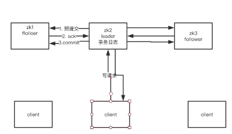

# Zookeeper

zookeeper = 文件系统 + 监听通知机制

## 常见用途

统一命名服务，状态同步服务，集群管理，分布式应用配置项的管理

### 分布式应用配置项的管理

  

## 节点类型

### PERSISTENT-持久化目录节点

客户端与ZK断开连接后，该节点依旧存在  

### PERSISTENT_SEQUENTIAL-持久化顺序编号目录节点

客户端与zookeeper断开连接后，该节点依旧存在，只是Zookeeper给该节点名称进行顺序编号  

### EPHEMERAL-临时目录节点

客户端与zookeeper断开连接后，该节点被删除  

### EPHEMERAL_SEQUENTIAL-临时顺序编号目录节点

客户端与zookeeper断开连接后，该节点被删除，只是zookeeper给该节点名称进行顺序编号  

> 对于持久节点和临时节点，同一个ZNode下，节点的名称是唯一的

## 两种请求

### 事务性请求

增加，删除，修改等涉及数据变动的请求。  

每个事务请求会生成一个事务ID(zxid)，这个事务ID是由小到大自增的，并且若不是leader节点接收到了事务性请求，那节点会将此请求转发给leader节点，由leader节点来处理此次请求  

### 非事务性请求

读操作和exists操作等，不涉及数据变动的请求。  

直接在哪个节点上请求，就在哪个节点上返回给客户端，不用与其他节点进行交互。  

## 保证一致性的要素

### 领导者选举

#### 发生的情况

1、集群启动  

2、Leader挂掉  

3、Follower挂掉后leader发现一家没有过半的Follower跟随自己了-不能对外提供服务了

#### 选举流程

1、每个节点自己有个投票箱，节点自己会给可用节点投一票(可以投给自己)  

2、各个节点自己同步其他节点所有的选票   

3、各个节点自己判断自己箱中的选票，首先根据zxid进行判断，最大的zxid胜出，此节点将选票投给zxid最大的节点，如果zxid相同，则投给myid最大的。  

4、只要半数的节点选取了同一个节点，则被选取的节点成为leader  

> 如果选举完成之后，一个节点带有比leader还大的zxid加入了集群，那个新加节点的数据将会进行回滚，回滚到和leader保持一致的状态

  


### 过半机制

参看选举流程

### 两阶段提交

  


## 面试问题

#### 为什么监听节点数据变化时，zookeeper不直接把变化的数据主动返回给client，而只告诉client数据发生了变化

避免过多的网络开销，有可能有的client当时不需要这份数据，让client来决定是否拉取数据，可以减轻服务端的压力

# 日志部分

## 修改zookeeper快照日志储存位置
在zoo.cfg中配置dataDir即可
例如：`dataDir=/opt/zookeeper-3.4.8/logs/data`
## 修改zookeeper事务日志储存位置
在zoo.cfg中配置dataLogDir即可
例如：`dataLogDir=/opt/zookeeper-3.4.8/logs/data/datalog`
## zookeeper配置快照与事务日志自动清理
在zookeeper中，如果不配置自动清理，zookeeper不会对这两项的数据文件进行清理操作，从而导致将服务器磁盘打满的状况，进而引起依赖zookeeper的相关应用报错而停止工作。  
`autopurge.snapRetainCount=10` 需要保留的文件数  
`autopurge.purgeInterval=48` 单位：小时，清理频率。保留48小时内的日志 
## 修改zookeeper.out输出位置
在默认情况下。zookeeper.out会输出到运行zkServer.sh时的当前目录下，这对于查看zookeeper运行日志时很不友好  
因此，可以修改zkServer.sh与zkEnv.sh来达到目的或者在环境变量中添加`ZOO_LOG_DIR="/opt/zookeeper-3.4.8/logs"`    
zkEnv.sh代码片段：  
```
if [ "x${ZOO_LOG_DIR}" = "x" ]
then
    ZOO_LOG_DIR="."
fi
```
可以知道，如果ZOO_LOG_DIR不存在，则会将当前目录作为日志输出目录，所以在zkEnv.sh中添加ZOO_LOG_DIR变量即可
例:`ZOO_LOG_DIR="/opt/zookeeper-3.4.8/logs"`  
zkServer.sh代码片段：  
```
_ZOO_DAEMON_OUT="$ZOO_LOG_DIR/zookeeper.out"
case $1 in
start)
    echo  -n "Starting zookeeper ... "
    if [ -f "$ZOOPIDFILE" ]; then
      if kill -0 `cat "$ZOOPIDFILE"` > /dev/null 2>&1; then
         echo $command already running as process `cat "$ZOOPIDFILE"`.
         exit 0
      fi
    fi
    nohup "$JAVA" "-Dzookeeper.log.dir=${ZOO_LOG_DIR}" "-Dzookeeper.root.logger=${ZOO_LOG4J_PROP}" \
    -cp "$CLASSPATH" $JVMFLAGS $ZOOMAIN "$ZOOCFG" > "$_ZOO_DAEMON_OUT" 2>&1 < /dev/null &
    if [ $? -eq 0 ]
    then
      case "$OSTYPE" in
      *solaris*)
        /bin/echo "${!}\\c" > "$ZOOPIDFILE"
        ;;
      *)
```
可以知道，日志输出位置是由`_ZOO_DAEMON_OUT`决定的，而_ZOO_DAEMON_OUT的值是由$ZOO_LOG_DIR决定的，因此，在zkServer.sh中添加ZOO_LOG_DIR即可  
例:`ZOO_LOG_DIR="/opt/zookeeper-3.4.8/logs"`  
## 修改zookeeper的日志储存形式，按天对日志进行储存
可以在环境变量中添加ZOO_LOG4J_PROP="INFO,ROLLINGFILE"，或者在zkEnv.sh中添加ZOOLOG4J_PROP变量  
然后修改log4j.properties文件
将zookeeper.root.logger的值修改为`INFO, ROLLINGFILE`  
将log4j.appender.ROLLINGFILE的值修改为`org.apache.log4j.DailyRollingFileAppender`  
并注释掉log4j.appender.ROLLINGFILE.MaxFileSize,因为在以日期的形式进行日志滚动的时候MaxFileSize与MaxBackUp这两个参数是无效的
## 查看zookeeper的事务日志
zookeeper的事务日志不能使用vim直接查看，需要通过`org.apache.zookeeper.server.LogFormatter`来进行查看，并且依赖slf4j
首先将libs中的slf4j-api-1.6.1.jar文件和zookeeper根目录下的zookeeper-3.4.9.jar文件复制到临时文件夹tmplibs中，然后执行如下命令：
`Java -classpath .:slf4j-api-1.6.1.jar:zookeeper-3.4.9.jar  org.apache.zookeeper.server.LogFormatter   ../Data/datalog/version-2/log.1`


