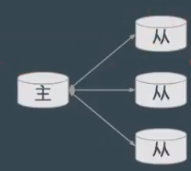
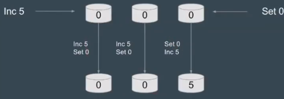

# CAP理论

  

对于一个分布式系统，不能同时满足以下三点：  

一致性(Consistency)  

可用性(Availability)  

分区容错性(Partition Tolerance)

# 一致性模型

## 弱一致性模型

最终一致性，例如DNS，Gossip(Cassandra的通信协议)  

写一条记录，在另外的节点上不能马上读到，但是经过一定时间之后是能读到的。

## 强一致性模型

Paxos，Raft，ZAB

## 强一致性算法

## 理论

### 主从同步

  

主从同步复制  

1、Master接受写请求  

2、Master复制日志到Slave  

3、Master等待，直到所有从库返回  

**问题** ：

一个节点失败，Master阻塞，导致整个集群不可用，保证了一致性，可用性却大大降低  

## 多数派

每次写都保证写入大于N / 2个节点，每次读保证从大于N / 2 个节点中读  

**问题**：  

 在并发环境下，无法保证系统正确性，顺序非常重要  

  

## 实现

### Paxos

basic Paxos

Multi Paxos

Fast Paxos